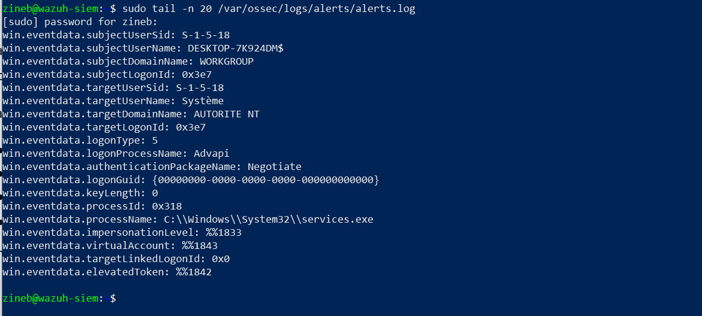
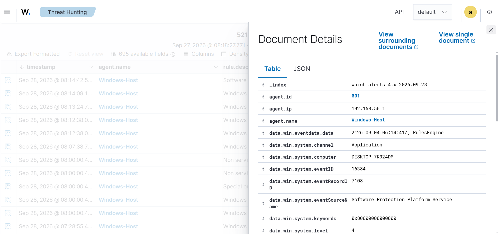
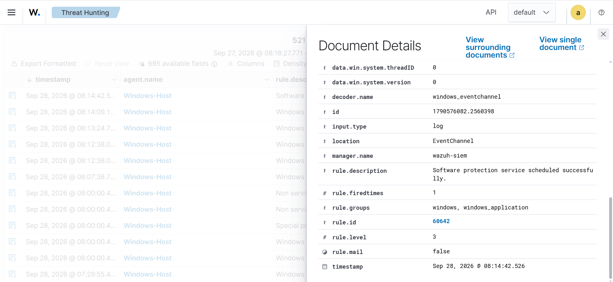

# J4 — Vérification de la remontée des événements Windows vers Wazuh

## 1. Introduction

La quatrième journée du projet est consacrée à la vérification du fonctionnement de la collecte des événements de sécurité Windows par la plateforme SIEM Wazuh.

Après l'installation et l'enregistrement de l'agent Wazuh sur la machine Windows lors de la journée précédente, l'objectif de cette étape est de vérifier que les événements générés sur le poste Windows sont correctement transmis à l'agent Wazuh, puis au serveur Wazuh et finalement visibles dans le Dashboard.

Cette étape permet de valider le fonctionnement de la chaîne de collecte :

**Windows → Agent Wazuh → Serveur Wazuh → Indexer → Dashboard**

---

## 2. Objectifs

Les objectifs de cette journée sont les suivants :

* vérifier que l'agent Windows est connecté au serveur Wazuh ;
* vérifier que les événements Windows sont collectés ;
* vérifier la transmission des événements vers le serveur Wazuh ;
* vérifier la présence des événements dans le Dashboard Wazuh ;
* examiner les informations associées à un événement Windows ;
* conserver des preuves visuelles des tests réalisés.

---

## 3. Architecture utilisée

L'environnement de test est constitué de deux machines principales.

| Élément                                | Configuration          |
| -------------------------------------- | ---------------------- |
| Machine Windows                        | Windows 10 Pro         |
| Agent                                  | Wazuh Agent 4.14.8     |
| Nom de l'agent                         | Windows-Host           |
| ID de l'agent                          | 001                    |
| Adresse IP Windows                     | 192.168.56.1           |
| Serveur Wazuh                          | wazuh-siem             |
| Adresse IP Wazuh                       | 192.168.56.10          |
| Communication                          | TCP                    |
| Port Wazuh utilisé pour les événements | 1514                   |
| Dashboard                              | HTTPS                  |
| Adresse du Dashboard                   | https://127.0.0.1:8443 |

La communication entre les deux machines est réalisée à travers le réseau Host-Only VirtualBox.

---

## 4. Vérification de la communication

La première vérification consiste à confirmer que la machine Windows peut communiquer avec le serveur Wazuh.

L'adresse IP du serveur Wazuh est :

```text
192.168.56.10
```

L'adresse IP du poste Windows est :

```text
192.168.56.1
```

La connectivité réseau entre les deux machines a été vérifiée avec succès.

Cette connectivité est nécessaire pour permettre à l'agent Wazuh de transmettre les événements collectés vers le serveur.

---

## 5. Vérification de l'agent Wazuh

L'agent Windows utilisé dans cette plateforme possède les informations suivantes :

```text
Agent ID      : 001
Agent Name    : Windows-Host
IP            : 192.168.56.1
Version       : 4.14.8
Status        : Active
```

L'état `Active` confirme que l'agent est correctement enregistré auprès du manager Wazuh et qu'une communication avec le serveur est établie.

---

## 6. Vérification de la remontée des événements

La remontée des événements a été vérifiée directement sur le serveur Wazuh.

Le fichier d'alertes du manager permet d'observer les événements traités par Wazuh.

La commande utilisée est :

```bash
sudo tail -n 20 /var/ossec/logs/alerts/alerts.log
```

Les résultats observés montrent la présence d'événements associés à l'agent :

```text
Windows-Host
```

avec l'identifiant :

```text
001
```

Cette observation confirme que le serveur Wazuh reçoit et traite des événements provenant du poste Windows.

### Capture 1 — Remontée des événements Windows



Cette capture montre la présence d'événements provenant de l'agent Windows dans les données traitées par le serveur Wazuh.

---

## 7. Vérification dans le Dashboard Wazuh

Une deuxième vérification a été réalisée depuis le Dashboard Wazuh.

Le Dashboard est accessible à l'adresse :

```text
https://127.0.0.1:8443
```

Dans la section de recherche des événements, le filtre suivant a été utilisé :

```text
agent.name:"Windows-Host"
```

Cette recherche permet d'afficher les événements associés spécifiquement au poste Windows supervisé.

La présence de résultats confirme que les événements collectés sont disponibles dans l'interface de supervision.

### Capture 2 — Événement Windows visible dans le Dashboard



Cette capture montre un événement provenant de l'agent `Windows-Host` directement dans le Dashboard Wazuh.

---

## 8. Analyse des détails d'un événement

Un événement Windows a ensuite été ouvert dans le Dashboard afin d'examiner ses informations détaillées.

Les informations disponibles permettent notamment d'identifier :

* le nom de l'agent ;
* l'identifiant de l'agent ;
* l'identifiant de l'événement Windows ;
* le canal Windows concerné ;
* le fournisseur de l'événement ;
* la date et l'heure de génération de l'événement ;
* les informations complémentaires associées à l'événement.

Ces informations sont importantes pour l'analyse de sécurité, car elles permettent de déterminer l'origine et le contexte d'un événement détecté.

### Capture 3 — Détails d'un événement Windows



Cette capture présente les informations détaillées associées à un événement Windows collecté par Wazuh.

---

## 9. Chaîne de collecte validée

Les tests réalisés permettent de vérifier les différentes étapes de la chaîne de supervision :

```text
┌─────────────────────────────┐
│       Windows 10            │
│     192.168.56.1            │
│                             │
│   Événements Windows        │
└──────────────┬──────────────┘
               │
               │ Wazuh Agent
               │ TCP 1514
               ▼
┌─────────────────────────────┐
│       Serveur Wazuh         │
│     192.168.56.10           │
│                             │
│  Collecte et traitement     │
└──────────────┬──────────────┘
               │
               ▼
┌─────────────────────────────┐
│      Wazuh Indexer          │
│                             │
│  Stockage des événements    │
└──────────────┬──────────────┘
               │
               ▼
┌─────────────────────────────┐
│      Wazuh Dashboard        │
│                             │
│ Analyse et visualisation    │
└─────────────────────────────┘
```

La chaîne de collecte Windows vers la plateforme Wazuh a ainsi été vérifiée.

---

## 10. Résultats des tests

| Test                                    | Résultat |
| --------------------------------------- | -------- |
| Communication Windows → serveur Wazuh   | Réussie  |
| Agent Windows enregistré                | Oui      |
| Agent Windows actif                     | Oui      |
| Réception d'événements par Wazuh        | Vérifiée |
| Événements visibles dans le Dashboard   | Oui      |
| Consultation des détails d'un événement | Oui      |
| Identification de l'agent source        | Oui      |

---

## 11. Interprétation

Les tests réalisés pendant cette journée montrent que l'agent Wazuh installé sur Windows fonctionne correctement dans l'environnement de laboratoire.

Les événements générés et collectés sur le poste Windows sont transmis au serveur Wazuh. Ils peuvent ensuite être consultés depuis le Dashboard afin d'être analysés.

La collecte des événements constitue une étape fondamentale de la plateforme SIEM. Elle permet de disposer des données nécessaires à la détection et à l'analyse des incidents de sécurité.

Cette validation permet donc de poursuivre le projet vers les étapes suivantes consacrées à la détection et à l'analyse de scénarios de sécurité.

---

## 12. Captures réalisées

Les preuves utilisées pour cette journée sont enregistrées dans le dépôt GitHub :

```text
screenshots/j4/j4-01-remontee-evenements-windows.png
screenshots/j4/j4-02-evenement-windows-dashboard.png
screenshots/j4/j4-03-details-evenement-windows.png
```

---

## 13. Compétences mises en œuvre

Cette journée a permis de mettre en pratique les compétences suivantes :

* administration d'un environnement Windows ;
* configuration et supervision d'un agent Wazuh ;
* collecte d'événements Windows ;
* supervision d'un poste Windows avec un SIEM ;
* analyse d'événements de sécurité ;
* utilisation du Dashboard Wazuh ;
* vérification de la communication agent-manager ;
* interprétation des données de supervision ;
* documentation technique ;
* gestion des preuves et captures dans GitHub.

---

## 14. Conclusion

La journée J4 a permis de vérifier le fonctionnement de la collecte des événements Windows dans la plateforme SIEM Wazuh.

L'agent `Windows-Host` est actif et les événements provenant du poste Windows sont visibles au niveau du serveur Wazuh et du Dashboard.

Les trois captures réalisées constituent les preuves de la remontée, de la visualisation et de l'analyse des événements.

La chaîne de collecte :

**Windows → Agent Wazuh → Serveur Wazuh → Indexer → Dashboard**

est ainsi fonctionnelle dans l'environnement de laboratoire.

La prochaine étape du projet portera sur la configuration et l'exploitation de mécanismes de détection permettant d'identifier des événements de sécurité spécifiques.
